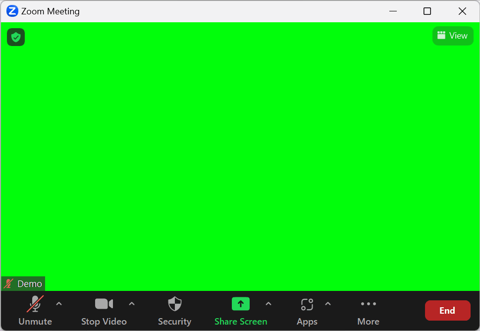
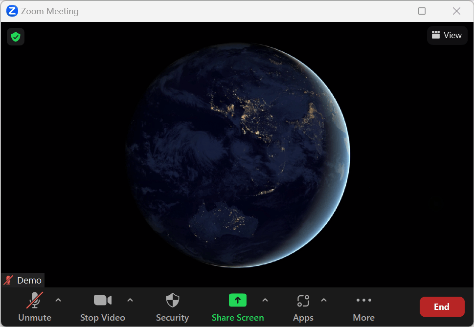
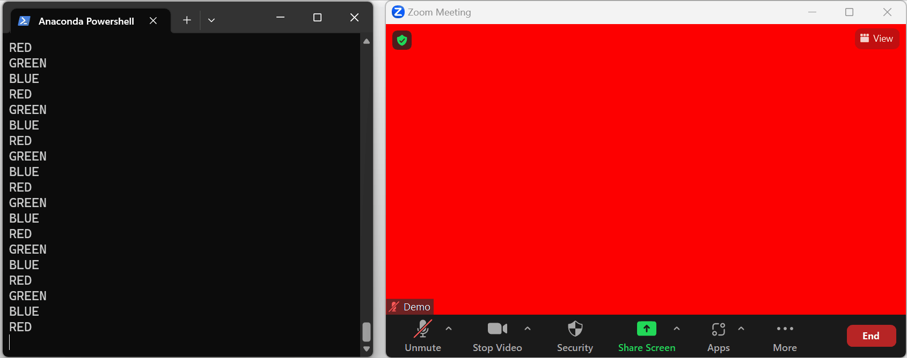

# Examples

## Simple

Source: [simple.py](simple.py)

```sh
python ./examples/simply.py
```



## Video

Source: [video.py](video.py)

```sh
# Download example mp4 from:
# https://file-examples.com/index.php/sample-video-files/sample-mp4-files/
python ./examples/video.py file_example_MP4_1280_10MG.mp4
```



## Latency

Source: [latency.py](latency.py)

```sh
python ./examples/latency.py
```



## Webcam Filter

Source: [webcam_filter.py](webcam_filter.py)

*screencast tbd*

## RGBA GIF

Source: [rgba_gif.py](rgba_gif.py)

*screencast tbd*
